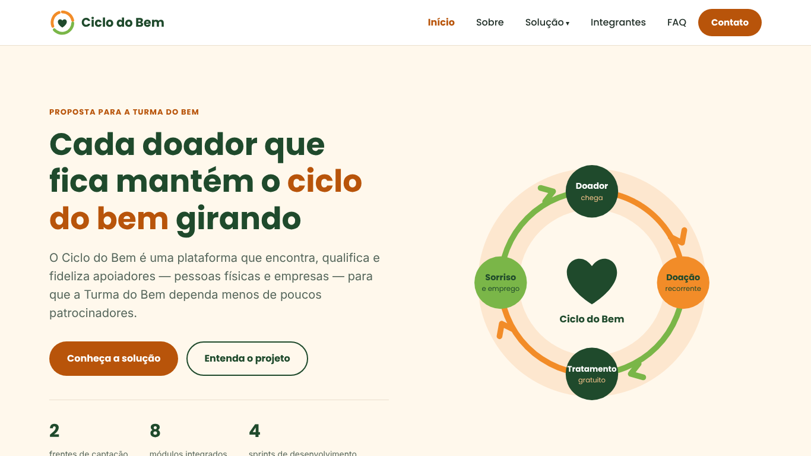
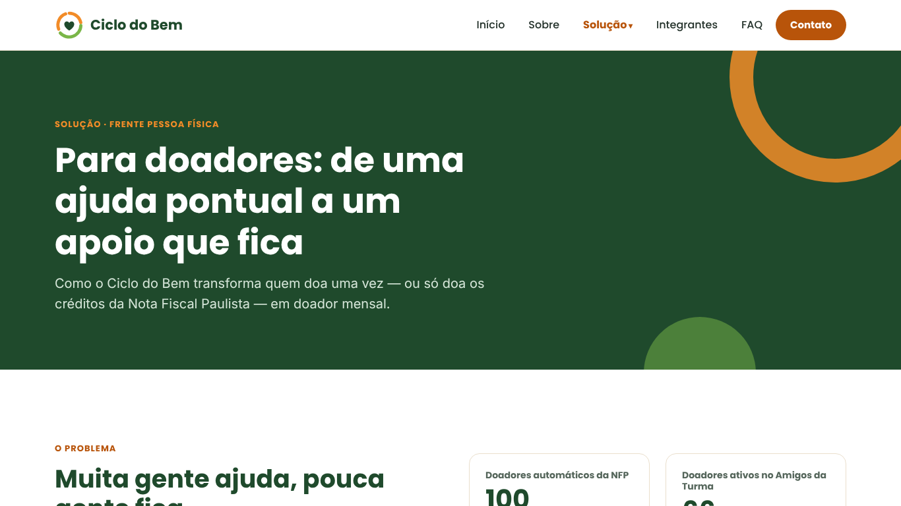
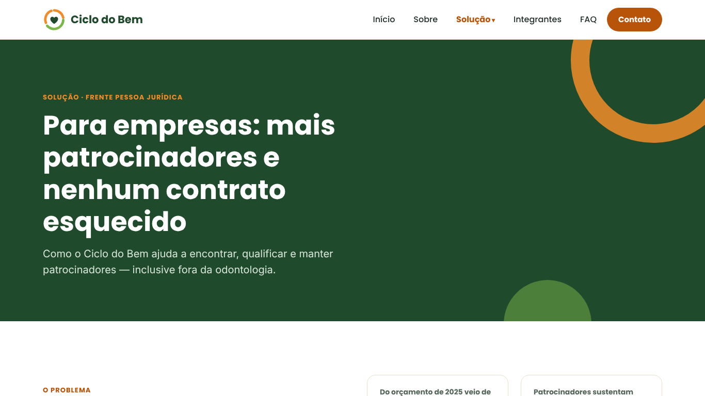
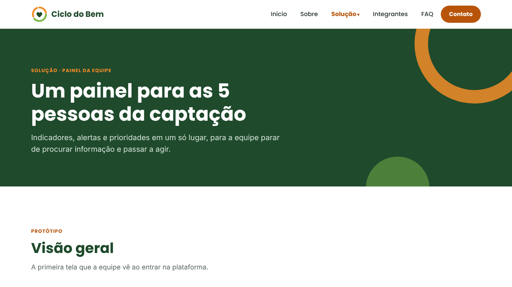

<p align="center">
  
</p>

<h1 align="center">Ciclo do Bem</h1>

<p align="center">
  Plataforma de captação e relacionamento com apoiadores, proposta para a <strong>Turma do Bem</strong><br>
  Challenge FIAP · Turma 1TDSPB · Sprint 1 de Front-End Design Engineering
</p>

---

## 🔗 Links do projeto

- **Repositório no GitHub:** [github.com/claudiosilva06/ciclo-do-bem](https://github.com/claudiosilva06/ciclo-do-bem)
- **Site publicado (GitHub Pages):** [https://claudiosilva06.github.io/ciclo-do-bem/](https://claudiosilva06.github.io/ciclo-do-bem/)

---

## 📌 Sobre o projeto

Em 2025, **75% do orçamento da Turma do Bem veio de patrocínio de empresas**, concentrado em cerca de 10 patrocinadores. Se um deles sai, jovens ficam sem tratamento odontológico.

O **Ciclo do Bem** é uma plataforma que **encontra, qualifica e fideliza apoiadores** em duas frentes, para diversificar a receita da organização:

- **Pessoas físicas:** a Nota Fiscal Paulista vira porta de entrada, com validação do print de confirmação por IA, jornada até a doação mensal, régua de relacionamento automática e um portal que mostra o impacto sem expor nenhum paciente.
- **Empresas:** funil de patrocinadores da prospecção à renovação, propostas de patrocínio além da odontologia, radar de editais e leis de incentivo e alerta de renovação de contratos.
- **Equipe:** painel com indicadores, alertas e prioridades sugeridas pela IA.

Nesta **Sprint 1**, o site é um **protótipo estático, somente desktop**, feito apenas com HTML e CSS. Os dados das telas de protótipo são ilustrativos; os números de 2025 foram informados pela Turma do Bem.

---

## 🖼️ Prints do site

| Página inicial | Solução para doadores |
| --- | --- |
|  |  |

| Solução para empresas | Painel da equipe |
| --- | --- |
|  |  |

---

## 🛠️ Tecnologias utilizadas

| Tecnologia | Uso no projeto |
| --- | --- |
| **HTML5** | Estrutura semântica das páginas (`header`, `nav`, `main`, `section`, `article`, `aside`, `footer`, `details`) |
| **CSS3** | Visual, layout com Flexbox e Grid, variáveis CSS e media queries para desktop |
| **Google Fonts** | Fontes Poppins (títulos) e Nunito (textos) |
| **SVG** | Logo, ícones e ilustrações criados pelo grupo |
| **Git e GitHub** | Versionamento e trabalho em equipe |

Nesta sprint **não** foi usado JavaScript, nem frameworks ou bibliotecas CSS.

---

## 📂 Estrutura de pastas

```
ciclo-do-bem/
├── index.html            # Página inicial
├── sobre.html            # Contexto, solução, tecnologias e roadmap
├── doador.html           # Solução 1: frente pessoa física (NFP e portal do doador)
├── empresas.html         # Solução 2: frente pessoa jurídica (funil e editais)
├── painel.html           # Solução 3: painel da equipe de captação
├── integrantes.html      # Quem somos
├── faq.html              # Perguntas frequentes
├── contato.html          # Formulário de contato
├── README.md
├── css/
│   ├── base.css          # Variáveis, tipografia, layout, cabeçalho, rodapé e botões
│   ├── componentes.css   # Cards, tabelas, formulários, FAQ, linha do tempo etc.
│   └── paginas.css       # Estilos específicos de cada página
└── assets/
    ├── icones/           # Ícones em SVG
    └── imagens/
        ├── integrantes/  # Fotos dos integrantes
        ├── prints/       # Prints usados neste README
        ├── logo-ciclo-do-bem.svg
        └── ilustracao-ciclo.svg
```

### Padrões adotados

- **Desktop:** `@media (min-width: 992px)` e `@media (min-width: 1300px)`, agrupadas no fim de cada arquivo CSS.
- **Nomes de classes** em português e pela função do elemento: `.btn-primario`, `.card-escuro`, `.campo-entrada`, `.menu-link-ativo`.
- **Cabeçalho e rodapé** iguais em todas as páginas, com o item atual destacado no menu.
- **Acessibilidade:** `alt` em todas as imagens, `label` em todos os campos, link "Pular para o conteúdo", foco visível no teclado e contraste adequado.

---

## 👥 Autores e créditos

| Foto | Nome | RM | Turma | Papel | Links |
| --- | --- | --- | --- | --- | --- |
|  | Asaffe Gabriel | 574554 | 1TDSPB | Front-End e design | [GitHub](https://github.com/Asaffeggmsmfj) · [LinkedIn](https://www.linkedin.com/in/asaffe-gabriel-bb4288302/) |
|  | Gustavo Almeida | 576939 | 1TDSPB | Back-end Java e DDD | [GitHub](https://github.com/gtzall) · [LinkedIn](https://www.linkedin.com/in/gustavo-almeida-rodrigues/) |
|  | Moises Alciati | 575893 | 1TDSPB | Banco de dados | [GitHub](https://github.com/moisesalciati) · [LinkedIn](https://www.linkedin.com/in/moises-de-oliveira-alciati-08a944441/) |
|  | Claudio Augusto Silva de Assis | 576661 | 1TDSPB | Python, IA e chatbot | [GitHub](https://github.com/claudiosilva06) · [LinkedIn](https://www.linkedin.com/in/claudio-augusto-b7660a433/) |

Projeto desenvolvido para o Challenge FIAP 2026 em parceria com a **Turma do Bem**. Os dados de 2025 citados no site foram informados pela organização.

---

## 📬 Contato

- **E-mail do grupo:** projetotdbfiap@gmail.com
- **Issues do repositório:** [github.com/claudiosilva06/ciclo-do-bem/issues](https://github.com/claudiosilva06/ciclo-do-bem/issues)
- Ou pela página [Contato](contato.html) do site.
